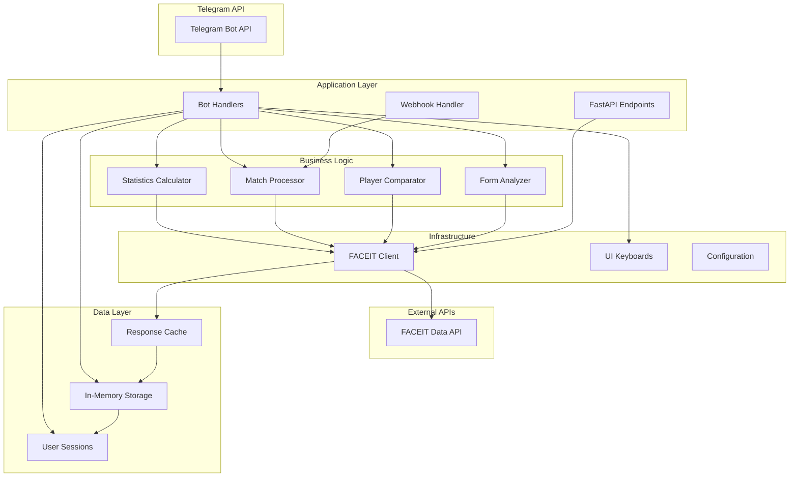

# 🏗️ Архитектура FACEIT CS2 Статистика Бота

## 📋 Обзор архитектуры

FACEIT CS2 Бот построен на основе современной асинхронной архитектуры с четким разделением ответственности между компонентами. Система использует event-driven подход и модульную структуру для обеспечения масштабируемости и поддерживаемости.

## 🎯 Основные принципы

- **Асинхронность**: Все I/O операции выполняются асинхронно
- **Модульность**: Четкое разделение функциональности между модулями  
- **Кэширование**: Агрессивное кэширование для снижения нагрузки на API
- **Отказоустойчивость**: Graceful handling ошибок и восстановление
- **Безопасность**: Минимальные привилегии и безопасная обработка данных

## 📊 Диаграмма компонентов



## 🔧 Архитектурные слои

### 1. Presentation Layer (Слой представления)
- **bot_handlers.py**: Основные обработчики Telegram команд
- **keyboards.py**: Генерация inline клавиатур для UI
- **match_handlers.py**: Обработчики матчей и уведомлений
- **history_handlers.py**: Обработчики истории матчей
- **additional_handlers.py**: Дополнительные функции (сравнение, анализ)

### 2. Application Layer (Слой приложения)
- **main.py**: Точка входа, конфигурация FastAPI и Aiogram
- **config.py**: Управление конфигурацией и переменными окружения

### 3. Business Logic Layer (Слой бизнес-логики)
- **faceit_client.py**: Клиент для работы с FACEIT API
- **Алгоритмы расчета**: HLTV 2.1, статистические метрики, анализ формы

### 4. Data Layer (Слой данных)
- **storage.py**: In-memory хранилище с кэшированием
- **Временные сессии**: 12-часовые игровые сессии
- **Кэш API**: Оптимизация запросов к внешним сервисам

## 🔄 Потоки данных

### 1. Пользовательское взаимодействие
```
Пользователь → Telegram → Bot Handler → Business Logic → FACEIT API → Response Cache → User Interface
```

### 2. Автоматические уведомления
```
FACEIT Webhook → Match Processor → User Lookup → Notification Sender → Telegram API
```

### 3. Кэширование
```
API Request → Cache Check → [Cache Hit: Return] OR [Cache Miss: FACEIT API → Cache Store → Return]
```

## 🗃️ Модель данных

### User Data Structure
```python
{
    "user_id": int,
    "faceit_id": str,
    "nickname": str,
    "linked_at": datetime,
    "settings": {
        "match_notifications": bool,
        "subscription_type": str,
        "language": str
    }
}
```

### Session Data Structure
```python
{
    "user_id": int,
    "start_time": datetime,
    "matches": [
        {
            "match_id": str,
            "finished_at": datetime,
            "won": bool,
            "kills": int,
            "deaths": int,
            "assists": int,
            "adr": float,
            "hltv_rating": float
        }
    ],
    "stats": dict
}
```

### Cache Data Structure
```python
{
    "cache_key": str,
    "data": dict,
    "timestamp": datetime,
    "ttl": int  # seconds
}
```

## ⚡ Производительность и оптимизации

### 1. Кэширование
- **Player Stats**: 5 минут TTL
- **Match Details**: 1 час TTL
- **Historical Data**: 24 часа TTL
- **Session Cleanup**: Каждый час

### 2. Rate Limiting
- **FACEIT API**: 10,000 запросов/час (базовый лимит)
- **Internal Limits**: 1 запрос/секунда на пользователя
- **Retry Logic**: Экспоненциальная задержка при 429 ошибках

### 3. Memory Management
- **Automatic Cleanup**: Старые кэш записи удаляются автоматически
- **Session Limits**: Максимум 200 матчей на сессию
- **Data Compression**: Оптимизация структур данных

## 🔐 Безопасность

### 1. Authentication & Authorization
- **API Keys**: Безопасное хранение в переменных окружения
- **User Isolation**: Каждый пользователь имеет доступ только к своим данным
- **Rate Limiting**: Предотвращение злоупотреблений

### 2. Data Protection
- **No Persistent Storage**: Все данные в памяти
- **Minimal Logging**: Никаких чувствительных данных в логах
- **Secure Defaults**: Безопасные настройки по умолчанию

### 3. Input Validation
- **Parameter Validation**: Проверка всех входящих данных
- **SQL Injection Protection**: Параметризованные запросы (где применимо)
- **XSS Prevention**: Экранирование пользовательского ввода

## 🚦 Обработка ошибок

### 1. Уровни ошибок
- **Client Errors** (4xx): Неверные пользовательские данные
- **Server Errors** (5xx): Внутренние ошибки системы
- **Network Errors**: Проблемы с внешними API
- **Rate Limit Errors**: Превышение лимитов запросов

### 2. Стратегии восстановления
- **Exponential Backoff**: Для временных сбоев
- **Circuit Breaker**: Для защиты от каскадных отказов  
- **Graceful Degradation**: Частичная функциональность при сбоях
- **User Notification**: Информирование пользователей о проблемах

## 📊 Мониторинг и логирование

### 1. Метрики производительности
- **Response Time**: Время ответа API endpoints
- **Throughput**: Количество запросов в секунду
- **Error Rate**: Процент ошибочных запросов
- **Cache Hit Rate**: Эффективность кэширования

### 2. Логирование
```python
# Структурированные логи
{
    "timestamp": "2024-01-01T12:00:00Z",
    "level": "INFO",
    "service": "faceit-bot",
    "user_id": 12345,
    "action": "get_player_stats",
    "duration_ms": 150,
    "status": "success"
}
```

## 🔄 Жизненный цикл запроса

### 1. User Command Processing
```
1. Telegram webhook/polling receives message
2. Aiogram dispatcher routes to appropriate handler  
3. Handler validates user and input
4. Business logic processes request
5. FACEIT API called with caching
6. Response formatted and cached
7. UI keyboard generated
8. Response sent to user
```

### 2. Background Tasks
```
1. Cleanup task runs every hour
2. Match notification checker runs every 2 minutes
3. Cache expiration handled automatically
4. Health checks performed periodically
```

## 📈 Масштабируемость

### 1. Горизонтальное масштабирование
- **Stateless Design**: Возможность запуска нескольких инстансов
- **Load Balancing**: Распределение нагрузки между инстансами
- **Database Sharding**: При переходе на постоянное хранилище

### 2. Вертикальное масштабирование
- **Memory Optimization**: Эффективное использование памяти
- **CPU Utilization**: Асинхронная обработка запросов
- **I/O Optimization**: Batching и connection pooling

## 🔧 Конфигурация и развертывание

### 1. Environment Configuration
```bash
# Основные параметры
BOT_TOKEN=telegram_bot_token
FACEIT_API_KEY=faceit_api_key
DEBUG=false

# Производительность
CACHE_TTL=300
MAX_SESSIONS=1000
CLEANUP_INTERVAL=3600

# Мониторинг
LOG_LEVEL=INFO
METRICS_ENABLED=true
HEALTH_CHECK_INTERVAL=30
```

### 2. Docker Configuration
- **Multi-stage Build**: Оптимизация размера образа
- **Health Checks**: Автоматическая проверка состояния
- **Resource Limits**: Контроль использования ресурсов
- **Volume Mounts**: Персистентность логов и конфигурации

## 🔮 Планы развития

### 1. Краткосрочные улучшения
- **Redis Integration**: Персистентное кэширование
- **Database Storage**: PostgreSQL для исторических данных
- **Advanced Analytics**: ML-модели для предсказаний
- **Multi-language Support**: Интернационализация

### 2. Долгосрочная стратегия
- **Microservices**: Разбиение на независимые сервисы
- **Event Sourcing**: Аудит всех изменений состояния
- **CQRS Pattern**: Разделение команд и запросов
- **GraphQL API**: Более гибкое API для клиентов

---

*Документ обновлен: 2024-01-01*  
*Версия архитектуры: 1.0.0*