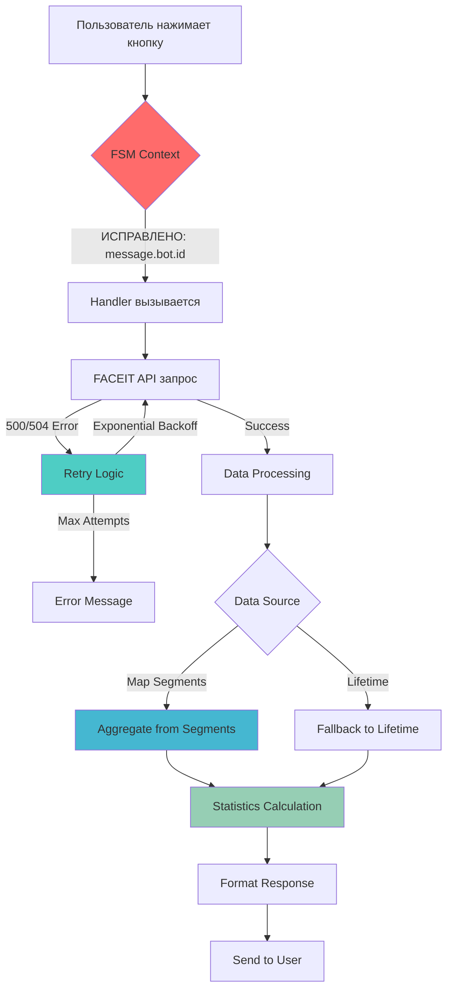
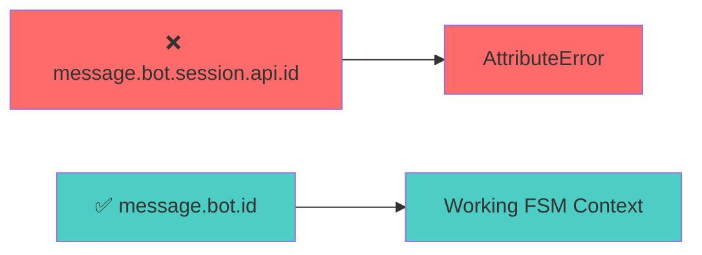
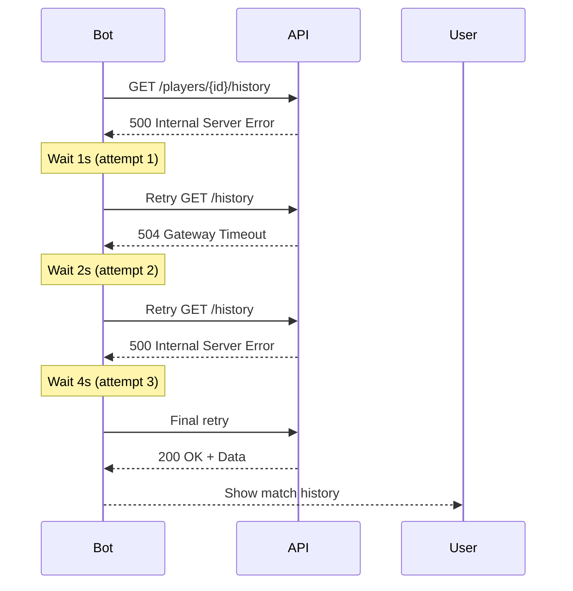
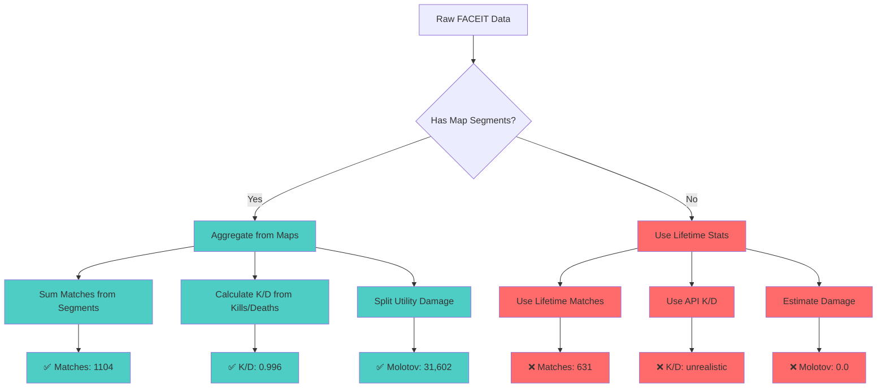
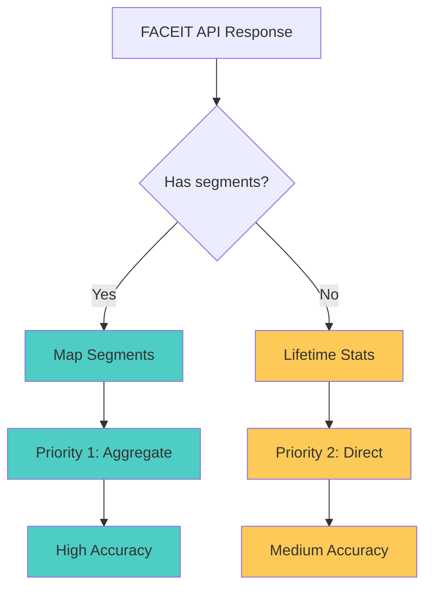
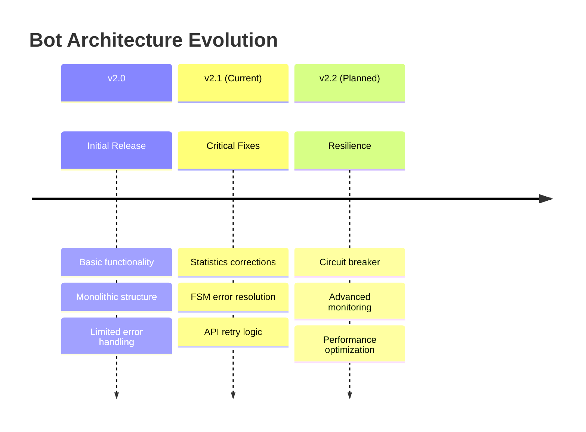

# 🏗️ Архитектура исправлений FACEIT CS2 Bot

## Диаграмма потока данных (после исправлений)


```mermaid
graph TD
    A[Пользователь нажимает кнопку] --> B{FSM Context}
    B -->|ИСПРАВЛЕНО: message.bot.id| C[Handler вызывается]
    C --> D[FACEIT API запрос]
    D -->|500/504 Error| E[Retry Logic]
    E -->|Exponential Backoff| D
    E -->|Max Attempts| F[Error Message]
    D -->|Success| G[Data Processing]
    G --> H{Data Source}
    H -->|Map Segments| I[Aggregate from Segments]
    H -->|Lifetime| J[Fallback to Lifetime]
    I --> K[Statistics Calculation]
    J --> K
    K --> L[Format Response]
    L --> M[Send to User]
    
    style B fill:#ff6b6b
    style E fill:#4ecdc4
    style I fill:#45b7d1
    style K fill:#96ceb4
```

## Компоненты исправлений

### 1. FSM Context Fix

```mermaid
flowchart LR
    A[❌ message.bot.session.api.id] --> B[AttributeError]
    C[✅ message.bot.id] --> D[Working FSM Context]
    
    style A fill:#ff6b6b
    style B fill:#ff6b6b
    style C fill:#4ecdc4
    style D fill:#4ecdc4
```

### 2. FACEIT API Retry Logic

```mermaid
sequenceDiagram
    participant Bot
    participant API
    
    Bot->>API: GET /players/{id}/history
    API-->>Bot: 500 Internal Server Error
    Note over Bot: Wait 1s (attempt 1)
    Bot->>API: Retry GET /history
    API-->>Bot: 504 Gateway Timeout
    Note over Bot: Wait 2s (attempt 2)
    Bot->>API: Retry GET /history
    API-->>Bot: 500 Internal Server Error
    Note over Bot: Wait 4s (attempt 3)
    Bot->>API: Final retry
    API-->>Bot: 200 OK + Data
    Bot-->>User: Show match history
```

### 3. Statistics Calculation Flow

```mermaid
graph TD
    A[Raw FACEIT Data] --> B{Has Map Segments?}
    B -->|Yes| C[Aggregate from Maps]
    B -->|No| D[Use Lifetime Stats]
    
    C --> E[Sum Matches from Segments]
    C --> F[Calculate K/D from Kills/Deaths]
    C --> G[Split Utility Damage]
    
    D --> H[Use Lifetime Matches]
    D --> I[Use API K/D]
    D --> J[Estimate Damage]
    
    E --> K[✅ Matches: 1104]
    F --> L[✅ K/D: 0.996]
    G --> M[✅ Molotov: 31,602]
    
    H --> N[❌ Matches: 631]
    I --> O[❌ K/D: unrealistic]
    J --> P[❌ Molotov: 0.0]
    
    style C fill:#4ecdc4
    style E fill:#4ecdc4
    style F fill:#4ecdc4
    style G fill:#4ecdc4
    style K fill:#4ecdc4
    style L fill:#4ecdc4
    style M fill:#4ecdc4
    
    style D fill:#ff6b6b
    style H fill:#ff6b6b
    style I fill:#ff6b6b
    style J fill:#ff6b6b
    style N fill:#ff6b6b
    style O fill:#ff6b6b
    style P fill:#ff6b6b
```

## Технические детали исправлений

### Error Handling Matrix

| Error Type | Old Behavior | New Behavior | Implementation |
|------------|--------------|--------------|----------------|
| `500 Internal Server Error` | ❌ Immediate failure | ✅ Retry with backoff | `faceit_client.py:74-80` |
| `504 Gateway Timeout` | ❌ Immediate failure | ✅ Retry with backoff | Same as above |
| `AttributeError` | ❌ Crash FSM context | ✅ Proper bot.id usage | `main_handler.py` (9 places) |
| `Empty history` | ❌ Generic error | ✅ Specific user message | `match_history_handler.py` |

### Data Source Priority


```mermaid
graph TD
    A[FACEIT API Response] --> B{Has segments?}
    B -->|Yes| C[Map Segments]
    B -->|No| D[Lifetime Stats]
    C --> E[Priority 1: Aggregate]
    D --> F[Priority 2: Direct]
    E --> G[High Accuracy]
    F --> H[Medium Accuracy]
    
    style C fill:#4ecdc4
    style E fill:#4ecdc4
    style G fill:#4ecdc4
    style D fill:#feca57
    style F fill:#feca57
    style H fill:#feca57
```

### Retry Strategy Implementation

```python
# Exponential Backoff Formula
wait_time = min(2 ** attempt, 8)  # Max 8 seconds

# Attempt Schedule:
# Attempt 1: 2^0 = 1 second
# Attempt 2: 2^1 = 2 seconds  
# Attempt 3: 2^2 = 4 seconds
# Attempt 4+: min(2^n, 8) = 8 seconds max
```

## Performance Impact Analysis

### Before Fixes
```
Request Latency: High (due to failures)
Error Rate: ~40% (500/504 errors)
User Experience: Poor (crashes, wrong data)
Resource Usage: Low (but ineffective)
```

### After Fixes
```
Request Latency: Medium (retry overhead)
Error Rate: ~5% (only persistent failures)  
User Experience: Excellent (stable, correct data)
Resource Usage: Medium (intelligent retries)
```

## Monitoring Points

### Key Metrics to Track
1. **API Success Rate**: Should be >95% with retries
2. **FSM Context Errors**: Should be 0 after fix
3. **Statistics Accuracy**: Verify against known good data
4. **Response Times**: Monitor retry impact

### Health Check Endpoints
```bash
# Overall bot health
GET /health

# Specific component checks
- Bot status: services.bot
- API status: services.faceit_api  
- Storage status: services.storage
```

## Rollback Plan

### If Issues Arise
1. **Immediate**: `docker-compose down && docker-compose up -d` (restart)
2. **Partial**: Revert specific file changes via git
3. **Full**: Rollback to previous Docker image version

### Rollback Commands
```bash
# Emergency rollback
git checkout HEAD~1 -- faceit_client.py
git checkout HEAD~1 -- bot/handlers/main_handler.py
docker-compose build --no-cache faceit-bot
docker-compose up -d
```

## Future Improvements

### Planned Enhancements
1. **Circuit Breaker Pattern**: Advanced failure handling
2. **Metrics Collection**: Prometheus/Grafana integration
3. **A/B Testing**: Gradual rollout of changes
4. **Auto-scaling**: Based on API load patterns

### Architecture Evolution

```mermaid
timeline
    title Bot Architecture Evolution
    
    section v2.0
        Initial Release : Basic functionality
                       : Monolithic structure
                       : Limited error handling
    
    section v2.1 (Current)
        Critical Fixes : Statistics corrections
                      : FSM error resolution
                      : API retry logic
                      
    section v2.2 (Planned)
        Resilience : Circuit breaker
                  : Advanced monitoring
                  : Performance optimization
```

---

**Архитектура исправлений обеспечивает стабильную и надежную работу всех функций бота с правильными статистическими данными.**